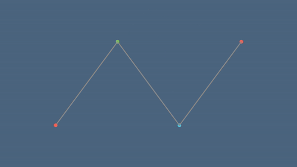
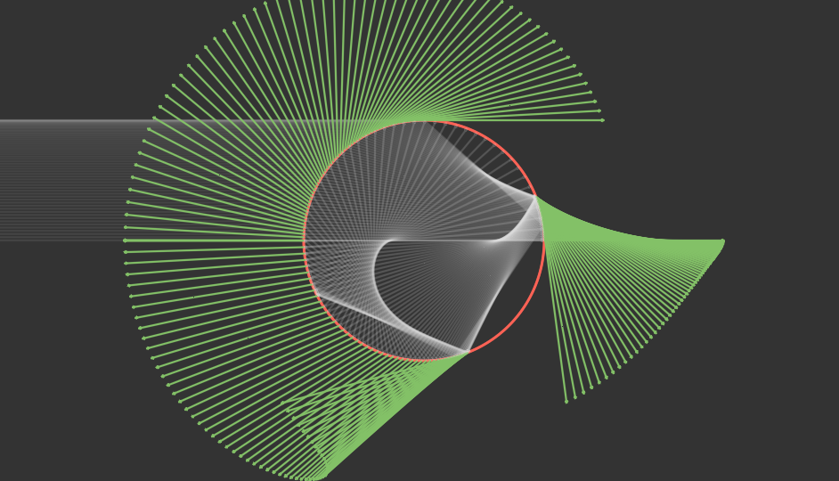

# manim_express
[](https://pypi.org/project/manim_express)
[](https://www.python.org/)
[](LICENSE)
[](https://github.com/beidongjiedeguang)


------------------------
[**English**](https://github.com/beidongjiedeguang/manim-express/blob/dev/README.md) |
[**中文说明**](https://github.com/beidongjiedeguang/manim-express/blob/dev/README_zh.md) 

## Install

```bash
pip install manim_express
```

# Quick start

* Render an animation: [3b1b:SquareToCircle](https://3b1b.github.io/manim/getting_started/quickstart.html#add-animations)

  ```python
  from manimlib import *
  from manim_express import EagerModeScene
  
  scene = EagerModeScene()
  circle = Circle()
  circle.set_fill(BLUE, opacity=0.5)
  circle.set_stroke(BLUE_E, width=4)
  
  square = Square()
  scene.play(ShowCreation(square))
  scene.play(ReplacementTransform(square, circle))
  
  scene.hold_on()
  ```

  Operating graphics:
  * hold down the `d` key or `mouse left` on the keyboard and move the mouse to change the three-dimensional perspective.
  * hold down the `s` key or `mouse right` on the keyboard and move the mouse to pan the screen
  * hold down the `z` or `ctrl` on the keyboard while scrolling the middle mouse button to zoom the screen
  * scroll the middle mouse button to move the screen up and down
  * reset camera view by pressing `r`
  * close the window and exit the program by pressing `q` or `tab`
  * pause the animation by pressing `space` or `ctrl` or `alt`
  * previews animation clip by pressing `LEFT`
  * next animation clip: `RIGHT`
  * replay current animation clip: `DOWN`

* `manim_express` vs `Matplotlib`:  
  In some cases, you may need to install [LaTeX](https://www.latex-project.org/get/#tex-distributions) to render `tex` fonts.  
  Fortunately, online latex compilation option is available. Just set `CONFIG.use_online_tex=True`

  ```python
  from manimlib import *
  from manim_express import *
  import numpy as np
  CONFIG.use_online_tex = True # Use online latex compiler
  
  theta = np.linspace(0, 2*np.pi, 200)
  x = np.cos(theta)
  y = np.sin(theta)
  
  # matplotlib
  # import matplotlib.pyplot as plt
  # plt.plot(x, y, color='green', linewidth=2)
  # plt.axis("equal")
  # plt.show()
  
  # manim_express
  scene = EagerModeScene()
  scene.plot(x, y, color=GREEN, width=2, scale_ratio=1)
  scene.show_plot()
  
  scene.hold_on()
  ```
  
  


# Resources

* Wiki  
  https://flyingframes.readthedocs.io/en/latest/index.html  
  https://3b1b.github.io/manim/  
  https://docs.manim.org.cn/  
  https://docs.manim.org.cn/shaders/
  
* 3B1B videos:  
  https://github.com/3b1b/videos

* export pptx
  * https://github.com/yoshiask/manim-pptx
  * https://github.com/RythenGlyth/manim-pptx
  * https://manimcommunity.github.io/manim_editor/Tutorial/index.html


# Examples
- Bezier curve  
    
 
- GOA model  
  

- GOA  
  

- Apply function  
  


- Double pendulum  
  