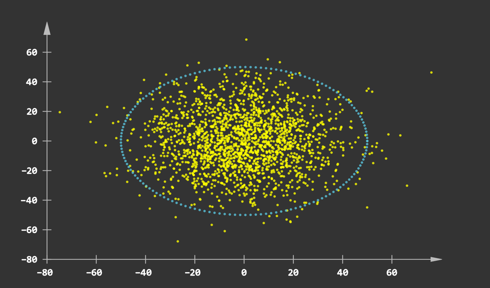
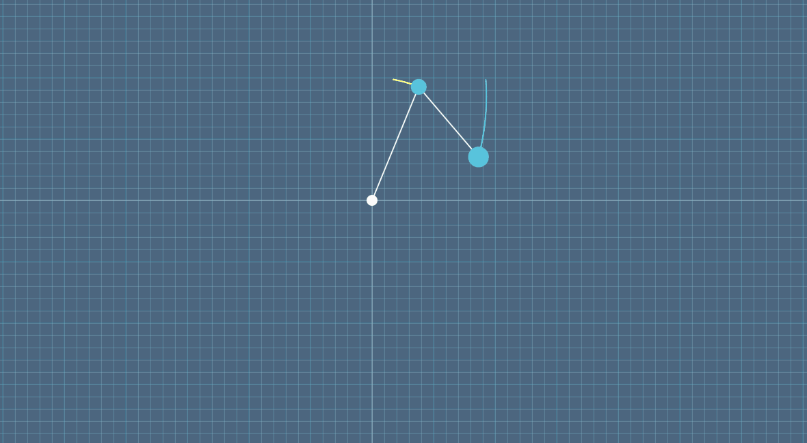

# manim_express
[](https://pypi.org/project/manim_express)
[](https://www.python.org/)
[](LICENSE)
[](https://github.com/beidongjiedeguang)


------------------------
[**English**](https://github.com/beidongjiedeguang/manim-express/blob/dev/README.md) |
[**中文说明**](https://github.com/beidongjiedeguang/manim-express/blob/dev/README_zh.md) 

## Install

```bash
pip install manim_express
```

## Run in pycharm
> https://stackoverflow.com/questions/44851652/how-to-allocate-a-pseudo-tty-in-which-to-run-scripts-from-ide
> 
> (Find action 'Registry' in PyCharm) named 'run.processes.with.pty' that allows to run Python processes with tty
# Quick start

* Render an animation: [3b1b:SquareToCircle](https://3b1b.github.io/manim/getting_started/quickstart.html#add-animations)

  ```python
  from manimlib import *
  from manim_express import GlEagerScene
  
  scene = GlEagerScene()
  circle = Circle()
  circle.set_fill(BLUE, opacity=0.5)
  circle.set_stroke(BLUE_E, width=4)
  
  square = Square()
  scene.show_creation(square)
  scene.play(ReplacementTransform(square, circle))
  
  scene.hold_on()
  ```

  Operating graphics:
  * hold down the `d` key or `mouse left` on the keyboard and move the mouse to change the three-dimensional perspective.
  * hold down the `s` key or `mouse right` on the keyboard and move the mouse to pan the screen
  * hold down the `z` or `ctrl` on the keyboard while scrolling the middle mouse button to zoom the screen
  * scroll the middle mouse button to move the screen up and down
  * reset camera view by pressing `r`
  * close the window and exit the program by pressing `q` or `tab`
  * pause the animation by pressing `space` or `ctrl` or `alt`
  * previews animation clip by pressing `LEFT`
  * next animation clip: `RIGHT`
  * replay current animation clip: `DOWN`

* `manim_express` vs `Matplotlib`:  
  **Eager mode usage**:
  ```python
  from manimlib import *
  from manim_express import GlEagerScene
  CONFIG.use_online_tex = True # If you don't have installed latex locally.
  theta = np.linspace(0, 2*np.pi, 200)
  x = np.cos(theta)
  y = np.sin(theta)
  
  scene = GlEagerScene()
  scene.plot(x, y, color=GREEN, width=2, scale_ratio=1)
  scene.show_plot()
  scene.hold_on()
  ```
  **Object oriented usage**:

  ```python
  from manimlib import *
  from manim_express import GlEagerScene
  import numpy as np
  class ScatterExample(GlEagerScene):
      def clip_1(self):
        n_features = 2
        X = np.random.normal(0, 20, (2000, n_features))
        theta = np.linspace(0, np.pi*2, 150)
        r = 50
        x, y = r*np.cos(theta), r*np.sin(theta)
        self.scatter2d(X[:, 0], X[:, 1], size=.03, color=YELLOW, ratio=0.618)
        self.scatter2d(x, y, size=.03, color=BLUE)
  
  ScatterExample().render()
  ```
    
  
  


# Resources

* Wiki  
  https://flyingframes.readthedocs.io/en/latest/index.html  
  https://3b1b.github.io/manim/  
  https://docs.manim.org.cn/  
  
* 3B1B videos:  
  https://github.com/3b1b/videos

* export pptx
  * https://github.com/yoshiask/manim-pptx
  * https://github.com/RythenGlyth/manim-pptx
  * https://manimcommunity.github.io/manim_editor/Tutorial/index.html


# Examples

- Bezier curve  
 
  https://user-images.githubusercontent.com/32060638/159116579-083692a2-f12c-48c0-8abd-1ee147e63714.mp4

 
- GOA model

  https://user-images.githubusercontent.com/32060638/159116901-eafa5842-135c-47f5-85a8-c946099a160f.mp4


- GOA  
  

- Apply function  
  


- Double pendulum  
  


