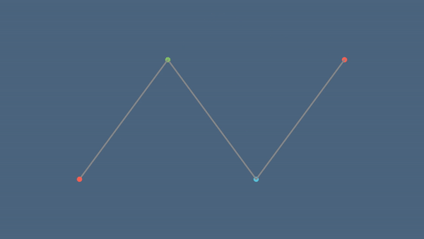
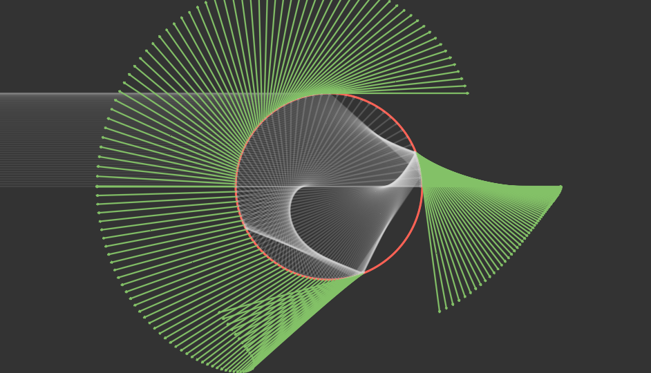
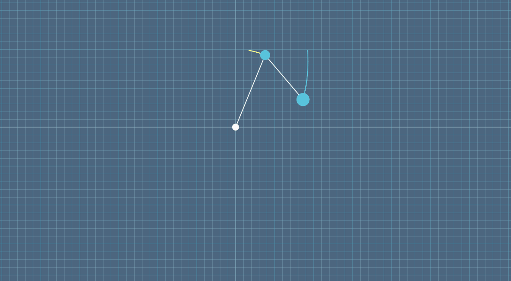

# manim_express
[](https://pypi.org/project/manim_express)
[](https://www.python.org/)
[](LICENSE)
[](https://github.com/beidongjiedeguang)


------------------------
[**English**](https://github.com/beidongjiedeguang/manim-express/blob/dev/README.md) |
[**中文说明**](https://github.com/beidongjiedeguang/manim-express/blob/dev/README_zh.md) 

## Install

```bash
pip install manim_express
```

以上步骤将安装 `manim_express` 和  [`manimlib`](https://github.com/beidongjiedeguang/manimlib). 然后就可以在任何代码位置导入使用这个动画库了.  


## 快速开始

* 渲染一个动画: [3b1b:SquareToCircle](https://3b1b.github.io/manim/getting_started/quickstart.html#add-animations)

  ```python
  from manimlib import *
  from manim_express import EagerModeScene
  
  scene = EagerModeScene()
  circle = Circle()
  circle.set_fill(BLUE, opacity=0.5)
  circle.set_stroke(BLUE_E, width=4)
  
  square = Square()
  scene.play(ShowCreation(square))
  scene.play(ReplacementTransform(square, circle))
  
  scene.hold_on()
  ```
  
  与渲染画面交互:
  * 按住 `d` 键 或 **鼠标左键** 然后移动鼠标可以改变三维空间中相机的旋转视角.
  * 按住 `s` 键 或 **鼠标右键** 然后移动鼠标可以平移相机. 
  * 按住 `z` 键 或 **ctrl键** 同时滚动鼠标滚轮以缩放画面. 
  * 通过 `r` 重制相机视角.
  * 离开/退出当前动画: `q` or `tab`
  * 暂停动画:  `space` or `ctrl` or `alt`
  * 前一段动画: `LEFT`
  * 后一段动画: `RIGHT`
  * 重新播放当前动画: `DOWN`
  
* `manim_express` vs `Matplotlib`:  
  在某些情况你需要安装[LaTeX](https://www.latex-project.org/get/#tex-distributions) 以渲染 `tex` 字体.  
  幸运的是`manim_express`中提供了在线的latex 编译选项. 通过设置 `CONFIG.use_online_tex=True` 进行激活.

  ```python
  from manimlib import *
  from manim_express import *
  import numpy as np
  CONFIG.use_online_tex = True # Use online latex compiler
  
  theta = np.linspace(0, 2*np.pi, 200)
  x = np.cos(theta)
  y = np.sin(theta)
  
  # matplotlib
  # import matplotlib.pyplot as plt
  # plt.plot(x, y, color='green', linewidth=2)
  # plt.axis("equal")
  # plt.show()
  
  # manim_express
  scene = EagerModeScene()
  scene.plot(x, y, color=GREEN, width=2, scale_ratio=1)
  scene.show_plot()
  
  scene.hold_on()
  ```
  
  


# 资源

* Wiki  
  https://flyingframes.readthedocs.io/en/latest/index.html  
  https://3b1b.github.io/manim/  
  https://docs.manim.org.cn/  
  https://docs.manim.org.cn/shaders/
  
* 3B1B videos:  
  https://github.com/3b1b/videos

* export pptx
  * https://github.com/yoshiask/manim-pptx
  * https://github.com/RythenGlyth/manim-pptx
  * https://manimcommunity.github.io/manim_editor/Tutorial/index.html


# Examples
- Bezier curve  
    
 
- GOA model  
  

- GOA  
  

- Apply function  
  


- Double pendulum  
  
